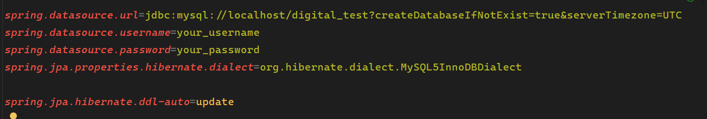
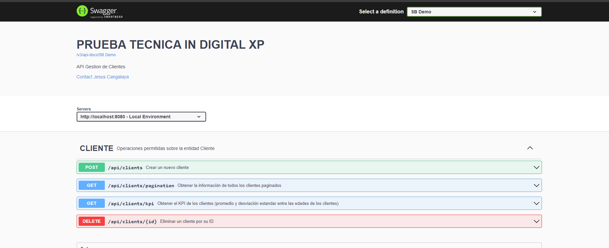
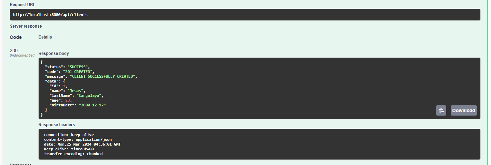
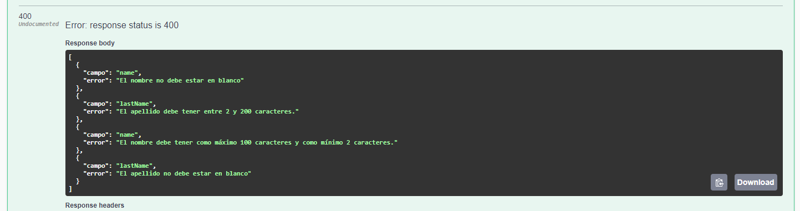
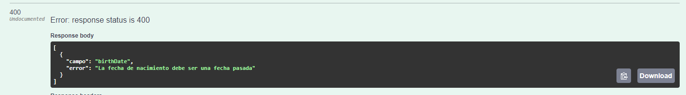
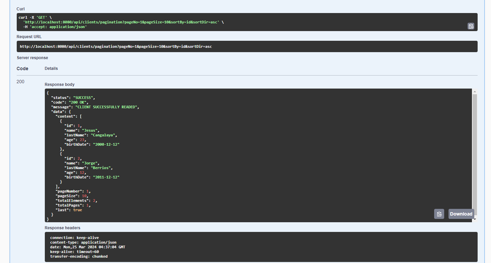
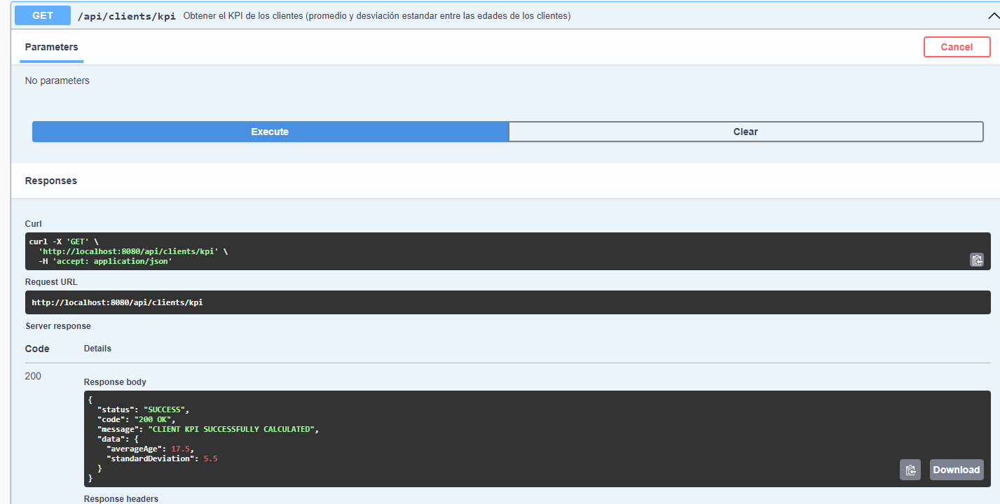
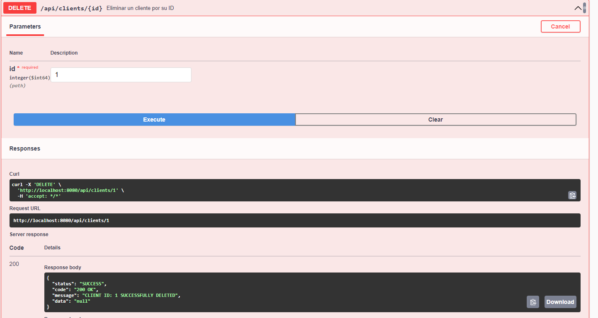

# Sistema para administrar clientes.

"Clone el repositorio y ejecute el proyecto en su IDE de preferencia.
 La base de datos MYSQL se creará automáticamente al ejecutar el proyecto,
 No olvide configurar las credenciales de la base de datos en el archivo `application.properties` ubicado en `src/main/resources/application.properties`."

## Tecnologias

- **Java Development Kit (JDK) 17:** Asegúrese de tener instalado JDK 17 en su sistema. Puede descargarlo desde [Oracle](https://www.oracle.com/java/technologies/javase-downloads.html) o [OpenJDK](https://adoptopenjdk.net/).

- **Spring Boot: 2.7.15**.

- **Base de datos MYSQL**

- **Swagger: http://localhost:8080/swagger-ui/index.html**

## Requerimientos

## Endpoints

- Endpoint de Entrada POST /creacliente
    - Nombre
    - Apellido
    - Edad
    - Fecha de nacimiento

- Endpoint de salida GET /kpideclientes
    - Promedio edad entre todos los clientes
    - Desviación estándar entre las edades de todos los clientes

- Endpoint de salida GET /listclientes
    - Lista de personas con todos los datos

## Extras

- Eliminación lógica.
- Uso de DTOs.
- @RestControllerAdvice para manejar excepciones globales en mi proyecto.
- Uso de Constantes para Mejor Legibilidad.
- Utilización de Genéricos para Flexibilidad.
- Campos validados.
- Documentación con Swagger.

## Screenshots
- **Swagger:**
http://localhost:8080/swagger-ui/index.html

- **POST /createClient:**

- **POST /Validacion de campos:**

- **GET / Lista paginada de clientes:**

- **GET / KPI de clientes:**

- **DELETE / Delete client:**

